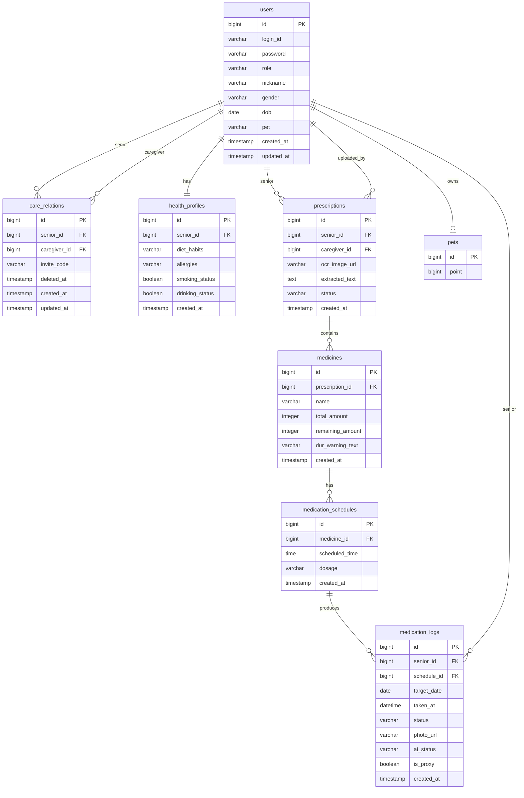

# Domain Model (초안)

> 이 문서는 **기능 구현의 공통 참조 기준**이다. 용어/경계/엔티티가 여기와 어긋나면 코드가 아니라 이 문서를 먼저 고친다.
> 초안이며, "오픈 이슈"의 결정이 반영될 때마다 갱신한다.

## 1) 서비스 개요
시니어의 규칙적인 복약을 돕고, 보호자가 복약 현황을 원격으로 확인할 수 있는 스마트 복약 관리 서비스.

핵심 파이프라인:

```
처방전 이미지
  → OCR(Naver Clova) + LLM 정제(Spring AI + Gemini)
  → 약물/복약 일정 등록
  → 지정 시간 알림(FCM + TTS)
  → 카메라 행동 인식(MediaPipe) + 약 개수 검증(Vision LLM)
  → 복약 기록
  → 보호자 리포트 / 삐약이 캐릭터 성장
```

## 2) 액터
| 액터 | 설명 |
|---|---|
| 시니어 (Senior) | 약을 실제로 복용하는 주 사용자. `users.role = SENIOR` |
| 보호자 (Caregiver) | 시니어와 연동되어 처방전 등록/모니터링을 수행. `users.role = CAREGIVER` |
| 시스템 | OCR 분석, 알림 발송, 행동 인식 판정 등 백그라운드 작업 수행 |

## 3) 바운디드 컨텍스트 맵

| Context | PR scope | 책임 | 주요 엔티티 |
|---|---|---|---|
| User | `user` | 계정, 인증, 역할, 보호자-시니어 연동, 건강 프로필 | `users`, `care_relations`, `health_profiles` |
| Prescription | `prescription` | 처방전 이미지, OCR 원문, 파싱/상태 | `prescriptions` |
| Medicine | `medicine` | 약물 기본 정보, 잔량, DUR 경고 텍스트 | `medicines` |
| Medication | `medication` | 복약 일정, 알림 발송 | `medication_schedules` (+ 알림 저장소 미정) |
| Health | `health` | 복약 기록, 행동 인식 결과, 이행률 | `medication_logs` |
| Pet | `pet` | 게이미피케이션: 삐약이 캐릭터 성장 | `pets` |
| Infra | `infra` | OCR/LLM/FCM/Storage 외부 연동 어댑터 | (테이블 없음) |

### 컨텍스트 의존성
- `prescription` → `medicine` (처방전이 약물을 생성)
- `medicine` → `medication` (약물이 복약 일정을 가짐)
- `medication` → `health` (일정이 복약 기록을 생성)
- `health` ─(복약 성공 이벤트)→ `pet` (약한 결합. 이벤트 리스너 기반 권장)
- `user` → 위 모든 컨텍스트 (소유자/액터)
- `infra`는 어댑터 계층이며 도메인에 의존받지 않는다

### `pet` 별도 스코프 유지 판단
1. 책임이 게이미피케이션으로 분리됨 (의료 데이터 모델과 무관)
2. 변경 주기가 다름 (밸런스/UX 피드백 기반의 잦은 변경)
3. PII 민감도가 낮아 로깅/분석 정책을 다르게 가져갈 수 있음
4. 의존이 단방향 (`pet`이 의료 데이터에 의존하지 않음)
5. 향후 확장(캐릭터 종류/아이템/랭킹) 여지

## 4) 유비쿼터스 랭귀지

| 한글 | 영문 | 정의 |
|---|---|---|
| 시니어 | Senior | 약을 실제로 복용하는 주 사용자 (`users.role = SENIOR`) |
| 보호자 | Caregiver | 시니어와 연동되어 처방전 등록/모니터링을 수행 |
| 연동 | Care Relation | 보호자와 시니어의 관계. `invite_code`로 초대/수락. soft delete(`deleted_at`) 지원 |
| 처방전 | Prescription | 병원에서 발급한 약물 처방 서류 이미지와 OCR 결과 |
| OCR 원문 | Extracted Text | Clova OCR이 추출한 텍스트(구조화 전) |
| 파싱 결과 | Parsed Result | LLM이 OCR 원문을 구조화한 약물 목록(JSON) |
| 약물 | Medicine | 처방전에서 파생되거나 수동 등록된 복용 대상 |
| 복약 일정 | Medication Schedule | 특정 약물을 언제 복용할지(`scheduled_time`, `dosage`) |
| 복약 기록 | Medication Log | 실제 복용 이행 여부 기록 (`status`, `ai_status`) |
| 복약 이행률 | Adherence Rate | 기간 내 성공 복약 / 예정 복약 |
| 대리 처리 | Proxy Confirmation | 보호자가 시니어 대신 복용 상태를 확정 (`is_proxy=true`) |
| DUR 점검 | Drug Utilization Review | 약물 상호작용/중복/금기 검증 |
| 행동 인식 | Action Recognition | MediaPipe 기반 손-입 근접 판정 |
| 비전 검증 | Vision Verification | 약 개수/상태를 Vision LLM으로 판정 |
| 삐약이 | Ppiyaki / Pet Character | 복약 성공 시 성장하는 게이미피케이션 캐릭터 |
| 리포트 | Report | 보호자용 복약 리포트 (스키마 미정) |

## 5) 엔티티 (코드 기준)

> 출처: `src/main/java/com/ppiyaki/**/*.java` 현재 HEAD 기준.
> 팀 제공 DBML에는 있지만 **코드에는 아직 반영되지 않은 항목**은 §7 오픈 이슈의 "계획됨" 항목으로 추적한다.

### 공통 시간 필드
- `CreatedTimeEntity` (`@MappedSuperclass`): `created_at` (`@CreatedDate`)
- `BaseTimeEntity extends CreatedTimeEntity`: `created_at` + `updated_at` (`@LastModifiedDate`)
- 아래 "시간 필드" 열에서 `created` = `CreatedTimeEntity`, `created+updated` = `BaseTimeEntity`, `-` = 상속 없음

### users (target: `@Table(name = "users")`, extends `BaseTimeEntity`)
계정 단위. 시니어/보호자 모두 한 테이블.

| 컬럼 | 타입 | 설명 |
|---|---|---|
| id | bigint PK (IDENTITY) | |
| login_id | varchar | 로그인 식별자 |
| password | varchar | 로컬 로그인용 (카카오 전용 전환 시 nullable 검토: §7-13) |
| role | varchar | `SENIOR` / `CAREGIVER` (후보, enum 미정) |
| nickname | varchar | 사용자 표시 이름 |
| gender | varchar | 성별 (코드 체계 미정: §7-14) |
| dob | date | 생년월일 (민감정보, 마스킹 정책: §7-15) |
| pet | varchar | 보유 캐릭터 식별 (`pets` 테이블과의 연결 방식: §7-1) |
| created_at / updated_at | timestamp | `BaseTimeEntity` |

> **코드 갭(현재 HEAD 기준)**: 코드의 `User.java`는 `nickname`, `gender`, `dob`가 없고 `pet` 대신 `ppiyaki bigint` 컬럼을 가진다. 이 문서는 **타깃 스키마**를 기술하며, 코드 갱신은 별도 PR로 진행한다. 추적: §7-16.

### care_relations (target: `@Table(name = "care_relations")`, extends `BaseTimeEntity`)
보호자–시니어 관계(1:N). 해제 시 soft delete.

| 컬럼 | 타입 | 설명 |
|---|---|---|
| id | bigint PK | |
| senior_id | bigint | `users.id` 참조 |
| caregiver_id | bigint | `users.id` 참조 |
| invite_code | varchar | 시니어가 보호자에게 발급/공유 |
| deleted_at | timestamp nullable | soft delete. NULL이면 활성 관계 |
| created_at / updated_at | timestamp | `BaseTimeEntity` |

> **코드 갭**: 현재 코드는 `caregiver_senior_mappings` 이름으로 존재하며 `deleted_at`이 없다. 타깃 이름과 soft delete 도입은 별도 PR. 추적: §7-17.

### health_profiles (`@Table(name = "health_profiles")`, extends `CreatedTimeEntity`)
시니어별 건강 배경 정보 (1:1).

| 컬럼 | 타입 | 설명 |
|---|---|---|
| id | bigint PK | |
| senior_id | bigint | `users.id` 참조 |
| diet_habits | varchar | 식습관 |
| allergies | varchar | 알러지 |
| smoking_status | boolean | 흡연 여부 |
| drinking_status | boolean | 음주 여부 |
| created_at | timestamp | `CreatedTimeEntity` (updated_at 없음) |

### prescriptions (`@Table(name = "prescriptions")`, extends `CreatedTimeEntity`)
처방전 업로드 + OCR 원문 보관.

| 컬럼 | 타입 | 설명 |
|---|---|---|
| id | bigint PK | |
| senior_id | bigint | `users.id` 참조 (대상 시니어) |
| caregiver_id | bigint | `users.id` 참조 (업로드 수행자) |
| ocr_image_url | varchar | 원본 이미지 저장 경로 |
| extracted_text | TEXT | OCR 원문 (`columnDefinition = "TEXT"`) |
| status | varchar | `UPLOADED`/`PROCESSING`/`SUCCESS`/`FAILED` (후보, enum 미정) |
| created_at | timestamp | `CreatedTimeEntity` |

### medicines (`@Table(name = "medicines")`, extends `CreatedTimeEntity`)
처방전에서 파생된 약물. 수동 등록 경로는 오픈 이슈 §7-5.

| 컬럼 | 타입 | 설명 |
|---|---|---|
| id | bigint PK | |
| prescription_id | bigint | `prescriptions.id` 참조 |
| name | varchar | 약물명 |
| total_amount | Integer | 처방 총량 |
| remaining_amount | Integer | 현재 잔량 |
| dur_warning_text | varchar | DUR 경고 요약 텍스트 |
| created_at | timestamp | `CreatedTimeEntity` |

### medication_schedules (`@Table(name = "medication_schedules")`, extends `CreatedTimeEntity`)
복약 일정. `medicine` 1건당 시간대별 N행으로 해석됨 (오픈 이슈 §7-6).

| 컬럼 | 타입 | 설명 |
|---|---|---|
| id | bigint PK | |
| medicine_id | bigint | `medicines.id` 참조 |
| scheduled_time | time (`LocalTime`) | 복용 시각 (일자 정보는 별도) |
| dosage | varchar | 1회 복용량 (예: `1정`) |
| created_at | timestamp | `CreatedTimeEntity` |

### medication_logs (`@Table(name = "medication_logs")`, extends `CreatedTimeEntity`)
복약 이행 기록. 일자별 × 스케줄별 1행.

| 컬럼 | 타입 | 설명 |
|---|---|---|
| id | bigint PK | |
| senior_id | bigint | `users.id` 참조 |
| schedule_id | bigint | `medication_schedules.id` 참조 |
| target_date | date (`LocalDate`) | 예정 복약 일자 |
| taken_at | datetime (`LocalDateTime`) | 실제 확인 시각 |
| status | varchar | 사용자 확정 상태 (후보: `TAKEN`/`MISSED`/`PENDING`) |
| photo_url | varchar | 비전 인증 사진 |
| ai_status | varchar | 비전 인증 판정 결과 (오픈 이슈 §7-9) |
| is_proxy | boolean | 보호자 대리 처리 여부 |
| created_at | timestamp | `CreatedTimeEntity` |

### pets (`@Table(name = "pets")`, **공통 시간 엔티티 상속 없음**)
삐약이 캐릭터. 현재 최소 구현 상태 — 성장 속성은 `point` 하나.

| 컬럼 | 타입 | 설명 |
|---|---|---|
| id | bigint PK | |
| point | bigint (`Long`) | 누적 포인트 (복약 성공 이벤트로 증가 — 오픈 이슈 §7-3) |

> `Pet.java`는 `CreatedTimeEntity`/`BaseTimeEntity`를 상속하지 않아 `created_at`/`updated_at`이 **없다**. 성장 이력을 시간순으로 추적하려면 별도 로그 테이블(`pet_growth_logs` 등) 도입을 고려 — §7-3.

### report (DBML 제안, 엔티티 클래스 미구현)
보호자용 리포트. 현재 코드에는 엔티티 클래스가 없다 (DBML 초안에만 존재). 스키마 결정 전까지 별도 엔티티로 다루지 않는다. 추적: §7-4.

## 6) ERD (Mermaid)

> DBML을 Mermaid `erDiagram`으로 재구성. 오타/오픈 이슈는 일단 합리적 해석으로 그림.



## 7) 오픈 이슈 (결정 대기)

| # | 주제 | 현상 | 결정 필요 |
|---|---|---|---|
| 7-1 | `users.pet` ↔ `pets` 테이블 연결 방식 | 타깃은 `users.pet varchar`로 보유 캐릭터를 코드/이름으로 참조. 현재 코드는 `ppiyaki bigint`로 PK 참조 형태 | `users.pet`이 카탈로그(캐릭터 종류 코드)인지 인스턴스 식별(`pets.id` 매핑)인지 확정 |
| 7-2 | `users.role` enum 정의 | varchar 자유값 | `SENIOR`/`CAREGIVER` enum 확정 및 컨버터 도입 |
| 7-3 | `pets` 성장 모델 | 현재 `id`, `point`만 존재. 레벨/스테이지/이력 없음 | 레벨/경험치/스테이지/성장 이력 로그 테이블 필요 여부 |
| 7-4 | `report` 스키마 | DBML에만 있고 엔티티 미구현 | 집계 대상(기간, 이행률, 실패 건수 등)과 테이블 도입 시점 |
| 7-5 | 수동 등록 약물 | `medicines.prescription_id` NOT NULL로 보임 | "더미 처방전" vs "nullable + 소유자 직결" 중 선택 |
| 7-6 | 요일/종료일 관리 | `medication_schedules`에 frequency/duration 없음 | 요일 비트마스크, 종료일 컬럼, 또는 별도 테이블 |
| 7-7 | DUR 결과 영속화 | 결과 저장 테이블 없음 | `dur_checks` 테이블 신설 여부 |
| 7-8 | 알림/FCM 토큰 | 테이블 없음 | `device_tokens`, `medication_reminders` 신설 여부 |
| 7-9 | `status` vs `ai_status` | 의미 구분 불명확 | 사용자 확정 상태 vs 비전 판정 상태로 분리 정의 |
| 7-10 | `is_proxy` | 보호자 대리 처리 의도로 추정 | 공식 정의와 허용 전이 상태 정의 |
| 7-11 | `pets` 대상 | 타깃 `users.pet`이 모든 user에 붙을 수 있음 | 시니어 전용인가 보호자도 포함인가 |
| 7-12 | 인덱스/제약 | 현재 엔티티에 unique/복합 인덱스 선언 없음 | `login_id` unique, `(target_date, schedule_id)` unique 등 |
| 7-13 | `password` nullable | 카카오 전용이면 불필요 | nullable 여부 및 로컬 로그인 허용 여부 |
| 7-14 | `users.gender` 코드 체계 | varchar 자유값 | `MALE`/`FEMALE`/`OTHER`/`UNKNOWN` 등 enum 확정 |
| 7-15 | `users.dob` 마스킹 정책 | 생년월일은 민감정보 | 로그/리포트 출력 시 연도만 노출, 풀 날짜는 권한 있는 쿼리에만 허용 |
| 7-16 | `users` 필드 확장 (코드 갭) | 타깃: `nickname`/`gender`/`dob`/`pet varchar`. 현재 코드: `ppiyaki bigint`만 존재하고 나머지 없음 | `User.java` 및 마이그레이션 PR로 코드 반영 |
| 7-17 | `caregiver_senior_mappings` → `care_relations` (코드 갭) | 타깃: 테이블 rename + `deleted_at` soft delete. 현재 코드: 원래 이름 유지, soft delete 없음 | 엔티티 클래스 rename + 마이그레이션 PR |
| 7-18 | `pets` 공통 시간 필드 | `Pet.java`가 `CreatedTimeEntity`를 상속하지 않음 | 생성/갱신 시각 필요성 판단 → 필요하면 상속 추가 |

## 8) 외부 연동 인벤토리

| 시스템 | 용도 | 접점 컨텍스트 |
|---|---|---|
| Naver Clova OCR | 처방전 텍스트 추출 | `prescription` (via `infra` adapter) |
| Spring AI + Gemini Flash 1.5 | OCR 결과 구조화, 챗봇 | `prescription`, (추후) 챗봇 |
| MediaPipe | 복약 행동 인식 (손-입 근접) | `health` (클라이언트 처리 가능성 높음) |
| Vision LLM (GPT-4o 후보) → YOLO 고도화 | 약 개수 감지 | `health` |
| Firebase Cloud Messaging | 푸시 알림 발송 | `medication` |
| TTS (구현체 미정) | 음성 알림 | `medication` |
| STT (구현체 미정) | 음성 입력 | (추후 챗봇) |
| Object Storage (S3/NCP Object Storage 등, 미정) | 처방전/인증 사진 저장 | `prescription`, `health` |

## 9) 기술 스택
| 항목 | 선택 |
|---|---|
| 언어 | Java 21 (LTS) |
| 프레임워크 | Spring Boot 3.5.3 |
| DB | MySQL 8.4.6 (NCP 매니지드) |
| 빌드 | Gradle |
| CI | GitHub Actions (`backend-ci.yml`) |

## 10) 갱신 규칙
- 이 문서는 **타깃 스키마**를 기술한다. 코드가 아직 따라오지 못한 항목은 §7 오픈 이슈에 "코드 갭"으로 기록한다.
- 엔티티 코드(`src/main/java/com/ppiyaki/**/*.java`)가 바뀌면 §5, §6을 같은 PR에서 갱신한다.
- 오픈 이슈가 해소되면 §7에서 제거하고 본문에 반영한다.
- 새 용어는 반드시 §4 유비쿼터스 랭귀지에 먼저 등재한 뒤 코드에서 사용한다.
