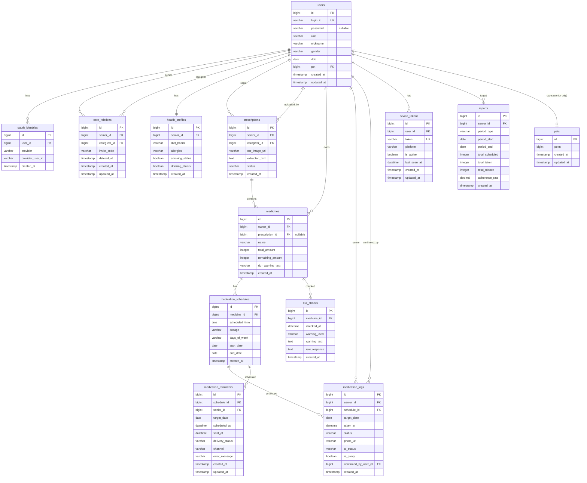

# Domain Model (초안)

> 이 문서는 **기능 구현의 공통 참조 기준**이다. 용어/경계/엔티티가 여기와 어긋나면 코드가 아니라 이 문서를 먼저 고친다.
> 초안이며, "오픈 이슈"의 결정이 반영될 때마다 갱신한다.

## 1) 서비스 개요
시니어의 규칙적인 복약을 돕고, 보호자가 복약 현황을 원격으로 확인할 수 있는 스마트 복약 관리 서비스.

핵심 파이프라인:

```
처방전 이미지
  → OCR(Naver Clova) + LLM 정제(Spring AI + Gemini)
  → 약물/복약 일정 등록
  → 지정 시간 알림(FCM + TTS)
  → 복약 확인 (약 개수 인식 — 세부 설계 보류)
  → 복약 기록
  → 보호자 리포트 / 삐약이 캐릭터 성장
```

## 2) 액터
| 액터 | 설명 |
|---|---|
| 시니어 (Senior) | 약을 실제로 복용하는 주 사용자. `users.role = SENIOR` |
| 보호자 (Caregiver) | 시니어와 연동되어 처방전 등록/모니터링을 수행. `users.role = CAREGIVER` |
| 시스템 | OCR 분석, 알림 발송, 리포트 집계 등 백그라운드 작업 수행 |

## 3) 바운디드 컨텍스트 맵

| Context | PR scope | 책임 | 주요 엔티티 |
|---|---|---|---|
| User | `user` | 계정, 인증, 역할, 보호자-시니어 연동, 건강 프로필, OAuth 연동 | `users`, `oauth_identities`, `care_relations`, `health_profiles` |
| Prescription | `prescription` | 처방전 이미지, OCR 원문, 파싱/상태 | `prescriptions` |
| Medicine | `medicine` | 약물 기본 정보, 잔량, DUR 경고 텍스트 | `medicines` |
| Medication | `medication` | 복약 일정, 알림 발송, FCM 토큰 | `medication_schedules`, `medication_reminders`, `device_tokens` |
| Health | `health` | 복약 기록, 리포트, DUR 점검 결과 | `medication_logs`, `reports`, `dur_checks` |
| Pet | `pet` | 게이미피케이션: 삐약이 캐릭터 성장 | `pets` |
| Infra | `infra` | OCR/LLM/FCM/Storage 외부 연동 어댑터 | (테이블 없음) |

### 컨텍스트 의존성
- `prescription` → `medicine` (처방전이 약물을 생성)
- `medicine` → `medication` (약물이 복약 일정을 가짐)
- `medication` → `health` (일정이 복약 기록을 생성)
- `health` ─(복약 성공 이벤트)→ `pet` (약한 결합. 이벤트 리스너 기반 권장)
- `user` → 위 모든 컨텍스트 (소유자/액터)
- `infra`는 어댑터 계층이며 도메인에 의존받지 않는다

### `pet` 별도 스코프 유지 판단
1. 책임이 게이미피케이션으로 분리됨 (의료 데이터 모델과 무관)
2. 변경 주기가 다름 (밸런스/UX 피드백 기반의 잦은 변경)
3. PII 민감도가 낮아 로깅/분석 정책을 다르게 가져갈 수 있음
4. 의존이 단방향 (`pet`이 의료 데이터에 의존하지 않음)
5. 향후 확장(캐릭터 종류/아이템/랭킹) 여지

## 4) 유비쿼터스 랭귀지

| 한글 | 영문 | 정의 |
|---|---|---|
| 시니어 | Senior | 약을 실제로 복용하는 주 사용자 (`users.role = SENIOR`) |
| 보호자 | Caregiver | 시니어와 연동되어 처방전 등록/모니터링을 수행 |
| 연동 | Care Relation | 보호자와 시니어의 관계. `invite_code`로 초대/수락. soft delete(`deleted_at`) 지원 |
| 처방전 | Prescription | 병원에서 발급한 약물 처방 서류 이미지와 OCR 결과 |
| OCR 원문 | Extracted Text | Clova OCR이 추출한 텍스트(구조화 전) |
| 파싱 결과 | Parsed Result | LLM이 OCR 원문을 구조화한 약물 목록(JSON) |
| 약물 | Medicine | 처방전에서 파생되거나 수동 등록된 복용 대상 |
| 복약 일정 | Medication Schedule | 특정 약물을 언제 복용할지(`scheduled_time`, `dosage`) |
| 복약 기록 | Medication Log | 실제 복용 이행 여부 기록 (`status`, `ai_status`) |
| 복약 이행률 | Adherence Rate | 기간 내 성공 복약 / 예정 복약 |
| 대리 처리 | Proxy Confirmation | 보호자가 시니어 대신 복용 상태를 확정 (`is_proxy=true`, `confirmed_by_user_id != senior_id`) |
| DUR 점검 | Drug Utilization Review | 약물 상호작용/중복/금기 검증. 결과는 `dur_checks`에 immutable 로그로 저장 |
| 약 개수 인식 | Pill Count Recognition | 복약 확인용 비전 기반 약 개수 판정. 세부 구현 보류 |
| 삐약이 | Ppiyaki / Pet Character | 복약 성공 시 성장하는 게이미피케이션 캐릭터 |
| 리포트 | Report | 보호자용 복약 리포트 (스키마 미정) |

## 5) 엔티티 (코드 기준)

> 출처: `src/main/java/com/ppiyaki/**/*.java` 현재 HEAD 기준.
> 팀 제공 DBML에는 있지만 **코드에는 아직 반영되지 않은 항목**은 §7 오픈 이슈의 "계획됨" 항목으로 추적한다.

### 공통 시간 필드
- `CreatedTimeEntity` (`@MappedSuperclass`): `created_at` (`@CreatedDate`)
- `BaseTimeEntity extends CreatedTimeEntity`: `created_at` + `updated_at` (`@LastModifiedDate`)
- 아래 "시간 필드" 열에서 `created` = `CreatedTimeEntity`, `created+updated` = `BaseTimeEntity`, `-` = 상속 없음

### users (target: `@Table(name = "users")`, extends `BaseTimeEntity`)
계정 단위. 시니어/보호자 모두 한 테이블.

| 컬럼 | 타입 | 설명 |
|---|---|---|
| id | bigint PK (IDENTITY) | |
| login_id | varchar | 로컬 로그인 식별자. UNIQUE |
| password | varchar nullable | 로컬 로그인용. OAuth 전용 유저는 NULL |
| role | varchar | DB는 varchar로 자유도 유지, Java는 `UserRole` enum(`SENIOR`/`CAREGIVER`)로 다루며 컨버터로 변환 |
| nickname | varchar | 사용자 표시 이름 |
| gender | varchar | DB는 varchar, Java는 `Gender` enum(`MALE`/`FEMALE`/`OTHER`/`UNKNOWN`) |
| dob | date | 생년월일 |
| pet | bigint | `pets.id` PK 참조 (FK 제약 선언 여부는 §7-12) |
| created_at / updated_at | timestamp | `BaseTimeEntity` |

> **코드 갭(현재 HEAD 기준)**: 코드의 `User.java`는 `nickname`, `gender`, `dob`가 없고 `pet` 대신 `ppiyaki bigint` 컬럼명을 사용하며 `password`가 non-null. 이 문서는 **타깃 스키마**를 기술하며, 코드 갱신은 별도 PR로 진행한다. 추적: §7-16.

### oauth_identities (target: `@Table(name = "oauth_identities")`, extends `CreatedTimeEntity`)
외부 IdP(카카오 등) 연동 정보. 하나의 `users` 계정이 여러 IdP에 연결될 수 있도록 분리.

| 컬럼 | 타입 | 설명 |
|---|---|---|
| id | bigint PK | |
| user_id | bigint | `users.id` 참조 |
| provider | varchar | `KAKAO` 등. DB는 varchar, Java는 `OAuthProvider` enum |
| provider_user_id | varchar | IdP 측 고유 식별자 |
| created_at | timestamp | `CreatedTimeEntity` |

> `(provider, provider_user_id)` 조합 UNIQUE 권장 (§7-12).
> **코드 갭**: 엔티티 클래스 미구현. 추적: §7-16.

### care_relations (target: `@Table(name = "care_relations")`, extends `BaseTimeEntity`)
보호자–시니어 관계(1:N). 해제 시 soft delete.

| 컬럼 | 타입 | 설명 |
|---|---|---|
| id | bigint PK | |
| senior_id | bigint | `users.id` 참조 |
| caregiver_id | bigint | `users.id` 참조 |
| invite_code | varchar | 시니어가 보호자에게 발급/공유 |
| deleted_at | timestamp nullable | soft delete. NULL이면 활성 관계 |
| created_at / updated_at | timestamp | `BaseTimeEntity` |

> **코드 갭**: 현재 코드는 `caregiver_senior_mappings` 이름으로 존재하며 `deleted_at`이 없다. 타깃 이름과 soft delete 도입은 별도 PR. 추적: §7-17.

### health_profiles (`@Table(name = "health_profiles")`, extends `CreatedTimeEntity`)
시니어별 건강 배경 정보 (1:1).

| 컬럼 | 타입 | 설명 |
|---|---|---|
| id | bigint PK | |
| senior_id | bigint | `users.id` 참조 |
| diet_habits | varchar | 식습관 |
| allergies | varchar | 알러지 |
| smoking_status | boolean | 흡연 여부 |
| drinking_status | boolean | 음주 여부 |
| created_at | timestamp | `CreatedTimeEntity` (updated_at 없음) |

### prescriptions (`@Table(name = "prescriptions")`, extends `CreatedTimeEntity`)
처방전 업로드 + OCR 원문 보관.

| 컬럼 | 타입 | 설명 |
|---|---|---|
| id | bigint PK | |
| senior_id | bigint | `users.id` 참조 (대상 시니어) |
| caregiver_id | bigint | `users.id` 참조 (업로드 수행자) |
| ocr_image_url | varchar | 원본 이미지 저장 경로 |
| extracted_text | TEXT | OCR 원문 (`columnDefinition = "TEXT"`) |
| status | varchar | `UPLOADED`/`PROCESSING`/`SUCCESS`/`FAILED` (후보, enum 미정) |
| created_at | timestamp | `CreatedTimeEntity` |

### medicines (target: `@Table(name = "medicines")`, extends `CreatedTimeEntity`)
약물. 처방전에서 파생되거나 **수동 등록**으로 생성.

| 컬럼 | 타입 | 설명 |
|---|---|---|
| id | bigint PK | |
| owner_id | bigint | `users.id` 참조. 약물의 소유 시니어. 수동 등록 시 직접 세팅 |
| prescription_id | bigint nullable | `prescriptions.id` 참조. 수동 등록 시 NULL |
| name | varchar | 약물명 |
| total_amount | Integer | 처방 총량 |
| remaining_amount | Integer | 현재 잔량 |
| dur_warning_text | varchar | DUR 경고 요약 텍스트(최근 dur_checks에서 복사된 요약) |
| created_at | timestamp | `CreatedTimeEntity` |

> **코드 갭 해소됨**: `owner_id` 추가 및 `prescription_id` nullable 전환 완료 (#15). 현재 코드와 타깃 스키마 일치.

### medication_schedules (target: `@Table(name = "medication_schedules")`, extends `CreatedTimeEntity`)
복약 일정. `medicine` 1건당 시간대별 N행.

| 컬럼 | 타입 | 설명 |
|---|---|---|
| id | bigint PK | |
| medicine_id | bigint | `medicines.id` 참조 |
| scheduled_time | time (`LocalTime`) | 복용 시각 |
| dosage | varchar | 1회 복용량 (예: `1정`) |
| days_of_week | varchar | 요일 패턴 (예: `MON,TUE,WED,THU,FRI` 또는 `DAILY`). 7비트 마스크 대신 가독성 우선 |
| start_date | date | 복약 시작일 |
| end_date | date nullable | 복약 종료일. NULL이면 무기한 |
| created_at | timestamp | `CreatedTimeEntity` |

> **코드 갭 해소됨**: `days_of_week`, `start_date`, `end_date` 추가 완료 (#16). 현재 코드와 타깃 스키마 일치.

### medication_logs (`@Table(name = "medication_logs")`, extends `CreatedTimeEntity`)
복약 이행 기록. 일자별 × 스케줄별 1행.

| 컬럼 | 타입 | 설명 |
|---|---|---|
| id | bigint PK | |
| senior_id | bigint | `users.id` 참조 |
| schedule_id | bigint | `medication_schedules.id` 참조 |
| target_date | date (`LocalDate`) | 예정 복약 일자 |
| taken_at | datetime (`LocalDateTime`) nullable | 실제 확인 시각 |
| status | varchar | 사용자 확정 상태. Java는 `LogStatus` enum(`TAKEN`/`MISSED`/`PENDING`) |
| photo_url | varchar nullable | 약 개수 인식용 사진 (복약 확인 이미지) |
| ai_status | varchar nullable | 약 개수 인식 판정 결과 (세부 설계 보류, §7-9) |
| is_proxy | boolean | 보호자 대리 처리 여부 (= `confirmed_by_user_id != senior_id`의 캐시) |
| confirmed_by_user_id | bigint nullable | 실제로 상태를 확정한 사용자(`users.id` 참조). 시니어 본인일 수도, 보호자일 수도 있음 |
| created_at | timestamp | `CreatedTimeEntity` |

> `(schedule_id, target_date)` UNIQUE 권장 (§7-12).
> **코드 갭**: 현재 코드에는 `confirmed_by_user_id`가 없음. 추적: §7-16.

### pets (target: `@Table(name = "pets")`, extends `BaseTimeEntity`)
삐약이 캐릭터. **시니어 전용** (보호자 유저에는 연결되지 않음).

| 컬럼 | 타입 | 설명 |
|---|---|---|
| id | bigint PK | |
| point | bigint (`Long`) | 누적 포인트. 복약 성공 이벤트로 증가 |
| created_at / updated_at | timestamp | `BaseTimeEntity` |

> **레벨/스테이지는 서버(도메인 로직)에서 `point`로부터 계산**한다. 예: `level = floor(sqrt(point / 10))`. 밸런스 변경 시 DB 마이그레이션 없이 재계산할 수 있어 기획 반복에 유리하다.
> **코드 갭**: 현재 `Pet.java`는 `CreatedTimeEntity`/`BaseTimeEntity`를 상속하지 않아 `created_at`/`updated_at`이 없다. 추적: §7-18.

### dur_checks (target: `@Table(name = "dur_checks")`, extends `CreatedTimeEntity`)
DUR 점검 결과의 immutable 로그. 약물 정보가 시간에 따라 변할 수 있으므로 **매 호출 시 새 레코드**로 기록한다(캐시 아님).

| 컬럼 | 타입 | 설명 |
|---|---|---|
| id | bigint PK | |
| medicine_id | bigint | `medicines.id` 참조 |
| checked_at | datetime (`LocalDateTime`) | 외부 DUR 호출 시각 |
| warning_level | varchar nullable | `NONE`/`INFO`/`WARN`/`BLOCK` 등 enum 후보 |
| warning_text | text nullable | 경고 요약 텍스트 (UI 표시용) |
| raw_response | text nullable | 외부 API 원본 응답 (감사용, 민감정보는 마스킹) |
| created_at | timestamp | `CreatedTimeEntity` |

> 가장 최근 결과가 필요하면 `(medicine_id, checked_at DESC)` 인덱스로 조회.
> 캐싱은 도입하지 않음(약물 정보 변경 가능성 때문). 외부 API 비용이 문제되면 후속 이슈에서 TTL 캐시 검토.

### device_tokens (target: `@Table(name = "device_tokens")`, extends `BaseTimeEntity`)
FCM 등 푸시 알림을 위한 디바이스 토큰.

| 컬럼 | 타입 | 설명 |
|---|---|---|
| id | bigint PK | |
| user_id | bigint | `users.id` 참조 |
| token | varchar | FCM 토큰. UNIQUE |
| platform | varchar | `IOS`/`ANDROID`/`WEB`. DB varchar + Java enum |
| is_active | boolean | 비활성 토큰은 false |
| last_seen_at | datetime nullable | 마지막 확인 시각 |
| created_at / updated_at | timestamp | `BaseTimeEntity` |

### medication_reminders (target: `@Table(name = "medication_reminders")`, extends `BaseTimeEntity`)
복약 알림 발송 기록/큐.

| 컬럼 | 타입 | 설명 |
|---|---|---|
| id | bigint PK | |
| schedule_id | bigint | `medication_schedules.id` 참조 |
| senior_id | bigint | `users.id` 참조 (발송 대상) |
| target_date | date | 예정 복약 일자 |
| scheduled_at | datetime | 알림 예약 시각 |
| sent_at | datetime nullable | 실제 발송 시각 |
| delivery_status | varchar | `PENDING`/`SENT`/`FAILED`/`DELIVERED`. DB varchar + Java enum |
| channel | varchar | `PUSH`/`TTS`/`VOICE`. DB varchar + Java enum |
| error_message | varchar nullable | 실패 사유 |
| created_at / updated_at | timestamp | `BaseTimeEntity` |

### reports (target: `@Table(name = "reports")`, extends `CreatedTimeEntity`)
보호자용 복약 리포트. 일간/월간 단위 집계.

| 컬럼 | 타입 | 설명 |
|---|---|---|
| id | bigint PK | |
| senior_id | bigint | `users.id` 참조 (리포트 대상 시니어) |
| period_type | varchar | `DAILY`/`MONTHLY`. DB varchar + Java enum |
| period_start | date | 집계 기간 시작 |
| period_end | date | 집계 기간 종료 |
| total_scheduled | integer | 기간 내 예정 복약 횟수 |
| total_taken | integer | 기간 내 성공(TAKEN) 횟수 |
| total_missed | integer | 기간 내 미복용(MISSED) 횟수 |
| adherence_rate | decimal(5,2) | 이행률(%) = total_taken / total_scheduled × 100 |
| created_at | timestamp | `CreatedTimeEntity` |

> `(senior_id, period_type, period_start)` UNIQUE 권장 (§7-12).
> 보호자는 `care_relations`를 통해 시니어의 리포트를 열람한다 — 리포트 자체에 `caregiver_id`는 두지 않는다.

## 6) ERD (Mermaid)

> DBML을 Mermaid `erDiagram`으로 재구성. 오타/오픈 이슈는 일단 합리적 해석으로 그림.



## 7) 오픈 이슈

> 결정된 정책은 본문에 이미 반영되었다. 이 섹션은 **코드 갭 추적**(코드↔문서 동기화)과 **인덱스/제약 메모**로만 사용한다.

### 7-A) 코드 갭 (코드 반영 대기)

타깃 스키마는 §5에 기술돼 있으나 엔티티 코드는 아직 따라오지 못한 항목. 각 항목은 별도 PR로 처리한다.

| # | 주제 | 갭 요약 |
|---|---|---|
| 7-16 | `users` 필드 확장 | 타깃: `nickname`/`gender`/`dob` 추가, `ppiyaki bigint` → `pet bigint` rename(PK 참조 유지), `password` nullable |
| 7-17 | `caregiver_senior_mappings` → `care_relations` | 테이블 rename + `deleted_at` soft delete 도입 |
| 7-18 | `Pet` 공통 시간 엔티티 상속 | `Pet.java`가 `BaseTimeEntity`를 상속하도록 변경해 `created_at`/`updated_at` 추가 |
| 7-19 | 신규 엔티티 구현 | `oauth_identities`, `dur_checks`, `device_tokens`, `medication_reminders`, `reports` 엔티티 클래스 신설 |
| 7-20 | `medication_schedules` 필드 확장 | `days_of_week`, `start_date`, `end_date` 추가 |
| 7-21 | `medication_logs` 필드 확장 | `confirmed_by_user_id` 추가 |
| 7-22 | `medicines` 소유 관계 | `owner_id` 추가, `prescription_id` nullable 전환 |

### 7-B) 인덱스/제약 후보 (§7-12)

도입 시 쓰기 성능에 명백한 악영향이 있으면 보류하고 메모만 남긴다.

| 대상 | 타입 | 용도 | 상태 |
|---|---|---|---|
| `users.login_id` | UNIQUE | 로컬 로그인 식별자 중복 방지 | 도입 권장 |
| `oauth_identities (provider, provider_user_id)` | UNIQUE | IdP별 식별자 중복 방지 | 도입 권장 |
| `device_tokens.token` | UNIQUE | 토큰 중복 방지 | 도입 권장 |
| `medication_logs (schedule_id, target_date)` | UNIQUE | 같은 일정·일자에 중복 기록 방지 | 도입 권장 |
| `dur_checks (medicine_id, checked_at DESC)` | INDEX | 최근 점검 결과 빠른 조회 | 도입 권장 |
| `reports (senior_id, period_type, period_start)` | UNIQUE | 같은 기간 리포트 중복 생성 방지 | 도입 권장 |
| `medication_reminders (delivery_status, scheduled_at)` | INDEX | 발송 대기 큐 조회 | 도입 권장 |
| `care_relations` 활성 관계 UNIQUE | UNIQUE partial | `deleted_at IS NULL`인 경우 `(senior_id, caregiver_id)` 중복 방지 | **보류** — MySQL 8 partial index 미지원. 애플리케이션 레벨로 처리하거나 generated column 검토 |

### 7-C) 세부 설계 보류

| # | 주제 | 현재 상태 |
|---|---|---|
| 7-9 | 약 개수 인식 세부 | MediaPipe 기반 행동 인식은 **제외**. 약 개수 인식으로 대체 예정이나 세부 기획 미완 → `medication_logs.photo_url`/`ai_status` 컬럼은 placeholder로 유지 |
| 7-23 | DB 마이그레이션 도구 도입 | **후순위.** 현재는 `src/main/resources/schema.sql`을 Hibernate metadata에서 추출해 운영 스키마를 관리. 운영 안정화 단계에서 Flyway/Liquibase 도입 검토. 도입 시 `application-prod.yml`의 `ddl-auto: validate` 정책과 부트스트랩 흐름(초기 schema.sql → migration baseline) 정리 필요 |

## 8) 외부 연동 인벤토리

| 시스템 | 용도 | 접점 컨텍스트 |
|---|---|---|
| Naver Clova OCR | 처방전 텍스트 추출 | `prescription` (via `infra` adapter) |
| Spring AI + Gemini Flash 1.5 | OCR 결과 구조화, 챗봇 | `prescription`, (추후) 챗봇 |
| 약 개수 인식 (구현체 미정) | 복약 확인 | `health` (세부 설계 보류, §7-9) |
| Firebase Cloud Messaging | 푸시 알림 발송 | `medication` (`medication_reminders`, `device_tokens`) |
| TTS (구현체 미정) | 음성 알림 | `medication` |
| STT (구현체 미정) | 음성 입력 | (추후 챗봇) |
| DUR API (구현체 미정) | 약물 상호작용/금기 점검 | `health` (`dur_checks`에 매 호출 결과 저장) |
| Object Storage (S3/NCP Object Storage 등, 미정) | 처방전/복약 확인 사진 저장 | `prescription`, `health` |

## 9) 기술 스택
| 항목 | 선택 |
|---|---|
| 언어 | Java 21 (LTS) |
| 프레임워크 | Spring Boot 3.5.3 |
| DB | MySQL 8.4.6 (NCP 매니지드) |
| 빌드 | Gradle |
| CI | GitHub Actions (`backend-ci.yml`) |

## 10) 갱신 규칙
- 이 문서는 **타깃 스키마**를 기술한다. 코드가 아직 따라오지 못한 항목은 §7 오픈 이슈에 "코드 갭"으로 기록한다.
- 엔티티 코드(`src/main/java/com/ppiyaki/**/*.java`)가 바뀌면 §5, §6을 같은 PR에서 갱신한다.
- 오픈 이슈가 해소되면 §7에서 제거하고 본문에 반영한다.
- 새 용어는 반드시 §4 유비쿼터스 랭귀지에 먼저 등재한 뒤 코드에서 사용한다.
