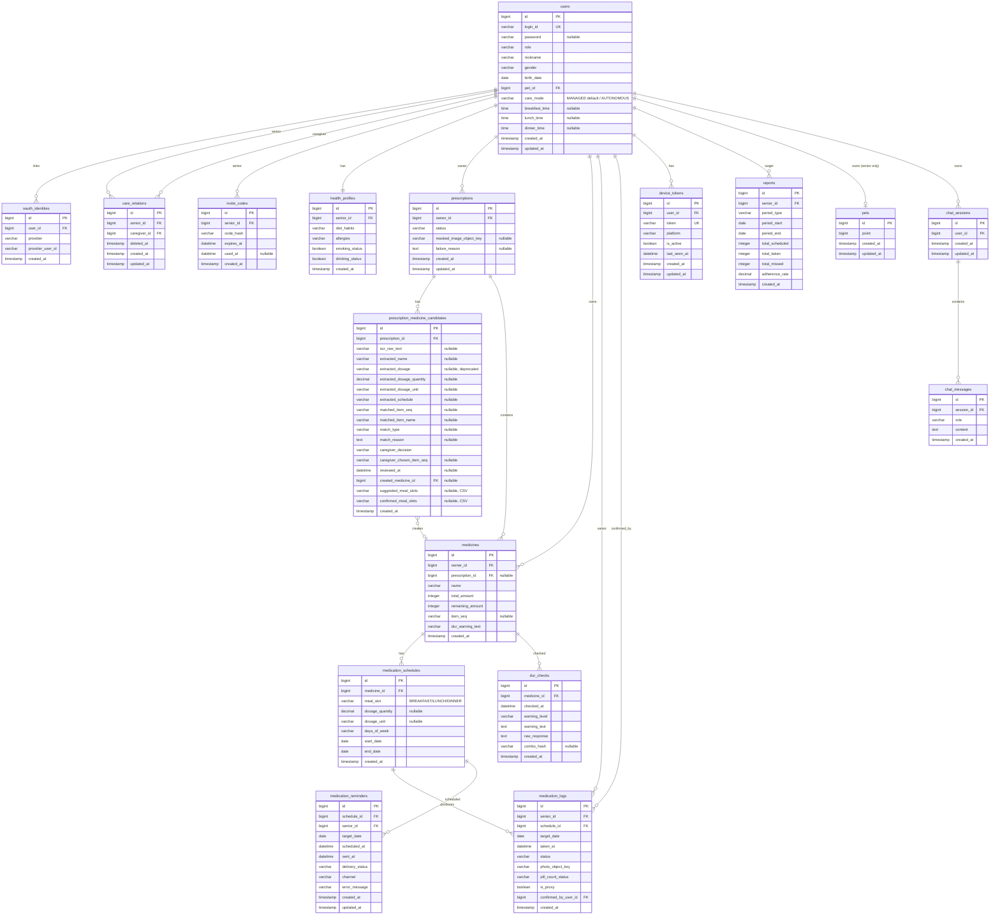

# Domain Model (초안)

> 이 문서는 **기능 구현의 공통 참조 기준**이다. 용어/경계/엔티티가 여기와 어긋나면 코드가 아니라 이 문서를 먼저 고친다.
> 초안이며, "오픈 이슈"의 결정이 반영될 때마다 갱신한다.

## 1) 서비스 개요
시니어의 규칙적인 복약을 돕고, 보호자가 복약 현황을 원격으로 확인할 수 있는 스마트 복약 관리 서비스.

핵심 파이프라인:

```
처방전 이미지
  → OCR(Naver Clova) + LLM 정제(Spring AI + Gemini)
  → 약물/복약 일정 등록
  → 지정 시간 알림(FCM + TTS)
  → 복약 확인 (약 개수 인식 — 세부 설계 보류)
  → 복약 기록
  → 보호자 리포트 / 삐약이 캐릭터 성장
```

## 2) 액터
| 액터 | 설명 |
|---|---|
| 시니어 (Senior) | 약을 실제로 복용하는 주 사용자. `users.role = SENIOR` |
| 보호자 (Caregiver) | 시니어와 연동되어 처방전 등록/모니터링을 수행. `users.role = CAREGIVER` |
| 시스템 | OCR 분석, 알림 발송, 리포트 집계 등 백그라운드 작업 수행 |

## 3) 바운디드 컨텍스트 맵

| Context | PR scope | 책임 | 주요 엔티티 |
|---|---|---|---|
| User | `user` | 계정, 인증, 역할, 보호자-시니어 연동, 건강 프로필, OAuth 연동 | `users`, `oauth_identities`, `care_relations`, `health_profiles` |
| Prescription | `prescription` | 처방전 이미지, OCR 원문, 파싱/상태 | `prescriptions` |
| Medicine | `medicine` | 약물 기본 정보, 잔량, DUR 경고 텍스트 | `medicines` |
| Medication | `medication` | 복약 일정, 알림 발송, FCM 토큰 | `medication_schedules`, `medication_reminders`, `device_tokens` |
| Health | `health` | 복약 기록, 리포트, DUR 점검 결과 | `medication_logs`, `reports`, `dur_checks` |
| Pet | `pet` | 게이미피케이션: 삐약이 캐릭터 성장 | `pets` |
| Chat | `chat` | AI 채팅 세션, 대화 히스토리, STT/TTS | `chat_sessions`, `chat_messages` |
| Infra | `infra` | OCR/LLM/FCM/Storage 외부 연동 어댑터 | (테이블 없음) |

### 컨텍스트 의존성
- `prescription` → `medicine` (처방전이 약물을 생성)
- `medicine` → `medication` (약물이 복약 일정을 가짐)
- `medication` → `health` (일정이 복약 기록을 생성)
- `health` ─(복약 성공 이벤트)→ `pet` (약한 결합. 이벤트 리스너 기반 권장)
- `user` → 위 모든 컨텍스트 (소유자/액터)
- `infra`는 어댑터 계층이며 도메인에 의존받지 않는다

### `pet` 별도 스코프 유지 판단
1. 책임이 게이미피케이션으로 분리됨 (의료 데이터 모델과 무관)
2. 변경 주기가 다름 (밸런스/UX 피드백 기반의 잦은 변경)
3. PII 민감도가 낮아 로깅/분석 정책을 다르게 가져갈 수 있음
4. 의존이 단방향 (`pet`이 의료 데이터에 의존하지 않음)
5. 향후 확장(캐릭터 종류/아이템/랭킹) 여지

## 4) 유비쿼터스 랭귀지

| 한글 | 영문 | 정의 |
|---|---|---|
| 시니어 | Senior | 약을 실제로 복용하는 주 사용자 (`users.role = SENIOR`) |
| 보호자 | Caregiver | 시니어와 연동되어 처방전 등록/모니터링을 수행 |
| 연동 | Care Relation | 보호자와 시니어의 관계. `invite_code`로 초대/수락. soft delete(`deleted_at`) 지원 |
| 처방전 | Prescription | 병원에서 발급한 약물 처방 서류 이미지와 OCR 결과 |
| OCR 원문 | Extracted Text | Clova OCR이 추출한 텍스트(구조화 전) |
| 파싱 결과 | Parsed Result | LLM이 OCR 원문을 구조화한 약물 목록(JSON) |
| 약물 | Medicine | 처방전에서 파생되거나 수동 등록된 복용 대상 |
| 복약 일정 | Medication Schedule | 특정 약물을 어떤 식사 슬롯에 복용할지(`meal_slot`, `dosage_quantity`/`dosage_unit`). 실제 시각은 시니어 mealTimes로 동적 계산 |
| 식사 슬롯 | Meal Slot | 복약 일정이 묶이는 식사 단위. `BREAKFAST`/`LUNCH`/`DINNER`. 실제 시각은 시니어의 `breakfast_time`/`lunch_time`/`dinner_time`을 매번 참조 |
| 제안 슬롯 | Suggested Meal Slots | OCR 시점에 LLM이 처방전 복약주기 텍스트로부터 제안한 식사 슬롯 후보. `prescription_medicine_candidates.suggested_meal_slots`(CSV)에 저장. 보호자 검수의 출발점 (Phase 3) |
| 확정 슬롯 | Confirmed Meal Slots | 보호자가 검수·확정한 식사 슬롯. `prescription_medicine_candidates.confirmed_meal_slots`(CSV). confirm 시 슬롯별 `medication_schedules` 자동 생성에 사용 (Phase 3) |
| 복약 기록 | Medication Log | 실제 복용 이행 여부 기록 (`status`, `pill_count_status`) |
| 복약 상태 | Log Status | 복약 기록의 사용자 확정 상태. `TAKEN` / `MISSED` / `PENDING`. `medication_logs.status`에 enum 매핑 |
| 알약 개수 검증 상태 | Log Pill Count Status | 복약 인증 사진 약 개수 AI 검증 결과. `COUNT_MATCH` / `COUNT_MISMATCH` / `COUNT_UNKNOWN` / `COUNT_FAILED`. `medication_logs.pill_count_status`에 enum 매핑 (Phase 2). 사진 + status=TAKEN일 때만 채워짐. Phase 3(낱알 식별) 진입 시 `pill_identification_status` 컬럼 분리 예정 |
| 복약 이행률 | Adherence Rate | 기간 내 성공 복약 / 예정 복약 |
| 대리 처리 | Proxy Confirmation | 보호자가 시니어 대신 복용 상태를 확정 (`is_proxy=true`, `confirmed_by_user_id != senior_id`) |
| 보호자 승인 모드 | Care Mode | 시니어의 처방전 변경 권한 정책. `MANAGED`(보호자 검증 강제, 0~72h 보호자 전용 + 72h 후 시니어 fallback) / `AUTONOMOUS`(시니어 즉시 변경 허용). `users.care_mode`에 저장. 변경은 보호자만 가능 |
| DUR 점검 | Drug Utilization Review | 약물 상호작용/중복/금기 검증. 결과는 `dur_checks`에 immutable 로그로 저장 |
| 약 개수 인식 | Pill Count Recognition | 복약 확인용 비전 기반 약 개수 판정. 세부 구현 보류 |
| 삐약이 | Ppiyaki / Pet Character | 복약 성공 시 성장하는 게이미피케이션 캐릭터 |
| 리포트 | Report | 보호자용 복약 리포트 (스키마 미정) |
| 채팅 세션 | Chat Session | AI 챗봇과의 대화 단위. 마지막 메시지 후 5분 경과 시 만료 |
| 채팅 메시지 | Chat Message | 세션 내 개별 메시지. 사용자(USER) 또는 AI 응답(ASSISTANT) |

## 5) 엔티티 (코드 기준)

> 출처: `src/main/java/com/ppiyaki/**/*.java` 현재 HEAD 기준.
> 팀 제공 DBML에는 있지만 **코드에는 아직 반영되지 않은 항목**은 §7 오픈 이슈의 "계획됨" 항목으로 추적한다.

### 공통 시간 필드
- `CreatedTimeEntity` (`@MappedSuperclass`): `created_at` (`@CreatedDate`)
- `BaseTimeEntity extends CreatedTimeEntity`: `created_at` + `updated_at` (`@LastModifiedDate`)
- 아래 "시간 필드" 열에서 `created` = `CreatedTimeEntity`, `created+updated` = `BaseTimeEntity`, `-` = 상속 없음

### users (target: `@Table(name = "users")`, extends `BaseTimeEntity`)
계정 단위. 시니어/보호자 모두 한 테이블.

| 컬럼 | 타입 | 설명 |
|---|---|---|
| id | bigint PK (IDENTITY) | |
| login_id | varchar | 로컬 로그인 식별자. UNIQUE |
| password | varchar nullable | 로컬 로그인용. OAuth 전용 유저는 NULL |
| role | varchar | DB는 varchar로 자유도 유지, Java는 `UserRole` enum(`SENIOR`/`CAREGIVER`)로 다루며 컨버터로 변환 |
| nickname | varchar | 사용자 표시 이름 |
| gender | varchar | DB는 varchar, Java는 `Gender` enum(`MALE`/`FEMALE`/`OTHER`/`UNKNOWN`) |
| birth_date | date | 생년월일 |
| pet_id | bigint | `pets.id` PK 참조 (FK 제약 선언 여부는 §7-12) |
| care_mode | varchar | DB는 varchar, Java는 `CareMode` enum(`MANAGED` default / `AUTONOMOUS`). 시니어 회원에 적용. 보호자 회원도 컬럼은 갖지만 처방전 흐름에서는 `prescription.owner_id`로 참조하는 시니어 측 값만 사용 |
| breakfast_time | time nullable | 시니어 식사 시간대(아침). Java는 `LocalTime`. 미설정 가능. Phase 1: 클라이언트가 schedule 등록 시 활용. Phase 2~3: 슬롯 매핑/자동 생성 (별도 spec). 변경 권한: 시니어 본인(`PUT /api/v1/users/me/meal-times`) 또는 연결된 보호자(`PUT /api/v1/users/{seniorId}/meal-times`, CareRelation 검증) |
| lunch_time | time nullable | 시니어 식사 시간대(점심). 동일 |
| dinner_time | time nullable | 시니어 식사 시간대(저녁). 동일 |
| notification_mode | varchar nullable | 알림 프리셋. Java는 `NotificationMode` enum(`BASIC_ALERT`/`INTENSIVE_CARE`). 시니어에만 적용. 온보딩 시 설정, 이후 개별 조정 가능 |
| created_at / updated_at | timestamp | `BaseTimeEntity` |

> **코드 갭(현재 HEAD 기준)**: 코드의 `User.java`는 `nickname`, `gender`, `dob`가 없고 `pet` 대신 `ppiyaki bigint` 컬럼명을 사용하며 `password`가 non-null. 이 문서는 **타깃 스키마**를 기술하며, 코드 갱신은 별도 PR로 진행한다. 추적: §7-16.

### oauth_identities (target: `@Table(name = "oauth_identities")`, extends `CreatedTimeEntity`)
외부 IdP(카카오 등) 연동 정보. 하나의 `users` 계정이 여러 IdP에 연결될 수 있도록 분리.

| 컬럼 | 타입 | 설명 |
|---|---|---|
| id | bigint PK | |
| user_id | bigint | `users.id` 참조 |
| provider | varchar | `KAKAO` 등. DB는 varchar, Java는 `OAuthProvider` enum |
| provider_user_id | varchar | IdP 측 고유 식별자 |
| created_at | timestamp | `CreatedTimeEntity` |

> `(provider, provider_user_id)` 조합 UNIQUE 권장 (§7-12).
> **코드 갭**: 엔티티 클래스 미구현. 추적: §7-16.

### care_relations (target: `@Table(name = "care_relations")`, extends `BaseTimeEntity`)
보호자–시니어 관계(1:N). 해제 시 soft delete.

| 컬럼 | 타입 | 설명 |
|---|---|---|
| id | bigint PK | |
| senior_id | bigint | `users.id` 참조. 보호자가 시니어 대리 생성 시 세팅 |
| caregiver_id | bigint | `users.id` 참조. 보호자 ID |
| deleted_at | timestamp nullable | soft delete. NULL이면 활성 관계 |
| created_at / updated_at | timestamp | `BaseTimeEntity` |

> 초대 코드는 `invite_codes` 테이블로 분리됨. `care_relations`의 `invite_code`/`expires_at` 컬럼은 레거시이며 추후 제거 예정.

### invite_codes (`@Table(name = "invite_codes")`, extends `CreatedTimeEntity`)
시니어 코드 로그인용 1회용 초대 코드. 평문이 아닌 hash로 저장.

| 컬럼 | 타입 | 설명 |
|---|---|---|
| id | bigint PK | |
| senior_id | bigint NOT NULL | `users.id` 참조. 로그인 대상 시니어 |
| code_hash | varchar NOT NULL | 초대 코드의 SHA-256 hash (평문 저장 안 함, O(1) lookup) |
| expires_at | datetime NOT NULL | 만료 시각 (발급 후 5분) |
| used_at | datetime nullable | 사용 완료 시각. NULL이면 미사용 |
| created_at | timestamp | `CreatedTimeEntity` |

### health_profiles (`@Table(name = "health_profiles")`, extends `CreatedTimeEntity`)
시니어별 건강 배경 정보 (1:1).

| 컬럼 | 타입 | 설명 |
|---|---|---|
| id | bigint PK | |
| senior_id | bigint | `users.id` 참조 |
| diet_habits | varchar | 식습관 |
| allergies | varchar | 알러지 |
| smoking_status | boolean | 흡연 여부 |
| drinking_status | boolean | 음주 여부 |
| created_at | timestamp | `CreatedTimeEntity` (updated_at 없음) |

### prescriptions (`@Table(name = "prescriptions")`, extends `BaseTimeEntity`)
처방전 업로드 단위. OCR → LLM 파싱 결과는 `prescription_medicine_candidates`에 저장.

| 컬럼 | 타입 | 설명 |
|---|---|---|
| id | bigint PK | |
| owner_id | bigint | `users.id` 참조 (업로드 수행자 — 보호자 또는 시니어 본인) |
| status | varchar | `PrescriptionStatus` enum: `UPLOADED`/`PROCESSING`/`REVIEW_NEEDED`/`COMPLETED`/`FAILED` |
| masked_image_object_key | varchar nullable | Object Storage 업로드 키 (마스킹된 이미지) |
| failure_reason | text nullable | OCR/LLM 실패 사유 |
| created_at / updated_at | timestamp | `BaseTimeEntity` |

> **코드 갭**: 이전 스키마(`senior_id`, `caregiver_id`, `ocr_image_url`, `extracted_text`)에서 재설계됨. 엔티티 코드 갱신 필요. 추적: §7-A 항목 추가.

### prescription_medicine_candidates (target: `@Table(name = "prescription_medicine_candidates")`, extends `CreatedTimeEntity`)
OCR + LLM 파싱으로 추출된 약물 후보. 처방전 1건당 N행. 보호자가 검토·확정하면 `medicines` 레코드가 생성된다.

| 컬럼 | 타입 | 설명 |
|---|---|---|
| id | bigint PK | |
| prescription_id | bigint | `prescriptions.id` 참조 |
| ocr_raw_text | varchar nullable | OCR이 인식한 원문 약물 텍스트 |
| extracted_name | varchar nullable | LLM이 추출한 약물명 |
| extracted_dosage | varchar nullable | LLM이 추출한 용량 (raw 문자열, deprecated 예정 — 정수+단위 분리 컬럼으로 점차 이전, spec `dosage-quantity-unit-split.md`) |
| extracted_dosage_quantity | decimal(5,2) nullable | 1회 복용량의 수치(분수 허용, 예: `1`, `0.5`). PRN 등 정의되지 않은 케이스는 NULL |
| extracted_dosage_unit | varchar(16) nullable | 단위 문자열(예: `정`, `캡슐`, `ml`, `mg`, `PRN`). 표준화 enum은 별도 follow-up |
| extracted_schedule | varchar nullable | LLM이 추출한 복약 일정 |
| matched_item_seq | varchar nullable | 식약처 DB 매칭된 품목 일련번호 |
| matched_item_name | varchar nullable | 식약처 DB 매칭된 품목명 |
| match_type | varchar nullable | `MatchType` enum: `EXACT`/`CANDIDATES`/`NO_MATCH` |
| match_reason | text nullable | 매칭 근거 설명 |
| caregiver_decision | varchar | `CaregiverDecision` enum: 보호자 검토 결과(`PENDING`/`APPROVED`/`REJECTED`/`MODIFIED` 등) |
| caregiver_chosen_item_seq | varchar nullable | 보호자가 직접 선택한 품목 일련번호 (MODIFIED 시) |
| reviewed_at | datetime nullable | 보호자 검토 완료 시각 |
| created_medicine_id | bigint nullable | 확정 후 생성된 `medicines.id` 참조 |
| suggested_meal_slots | varchar(64) nullable | LLM이 제안한 식사 슬롯 CSV (예: `BREAKFAST,LUNCH,DINNER`). 식사 무관/불명확이면 null. Phase 3 |
| confirmed_meal_slots | varchar(64) nullable | 보호자가 확정한 식사 슬롯 CSV. confirm 시 슬롯별 `medication_schedules` 자동 생성. Phase 3 |
| created_at | timestamp | `CreatedTimeEntity` |

> **코드 갭**: 신규 엔티티 — 엔티티 클래스 및 마이그레이션 미구현. 추적: §7-A 항목 추가.

### medicines (target: `@Table(name = "medicines")`, extends `CreatedTimeEntity`)
약물. 처방전에서 파생되거나 **수동 등록**으로 생성.

| 컬럼 | 타입 | 설명 |
|---|---|---|
| id | bigint PK | |
| owner_id | bigint | `users.id` 참조. 약물의 소유 시니어. 수동 등록 시 직접 세팅 |
| prescription_id | bigint nullable | `prescriptions.id` 참조. 수동 등록 시 NULL |
| name | varchar | 약물명 |
| total_amount | Integer | 처방 총량 |
| remaining_amount | Integer | 현재 잔량 |
| item_seq | varchar nullable | 식약처 품목 일련번호. DUR API 호출 키로 사용 |
| dur_warning_text | varchar | DUR 경고 요약 텍스트(최근 dur_checks에서 복사된 요약) |
| created_at | timestamp | `CreatedTimeEntity` |

> **코드 갭 해소됨**: `owner_id` 추가 및 `prescription_id` nullable 전환 완료 (#15).
> **코드 갭**: `item_seq` 컬럼 추가 필요. 추적: §7-A 항목 추가.

### medication_schedules (target: `@Table(name = "medication_schedules")`, extends `CreatedTimeEntity`)
복약 일정. `medicine` 1건당 식사 슬롯별 N행.

| 컬럼 | 타입 | 설명 |
|---|---|---|
| id | bigint PK | |
| medicine_id | bigint NOT NULL | `medicines.id` 참조 |
| meal_slot | varchar | DB는 varchar, Java는 `MealSlot` enum(`BREAKFAST`/`LUNCH`/`DINNER`). NOT NULL. 실제 시각은 시니어 mealTimes로 동적 계산 |
| dosage_quantity | decimal(5,2) nullable | 1회 복용량의 수치(분수 허용, 예: `1`, `0.5`). PRN 등 정의되지 않은 케이스는 NULL |
| dosage_unit | varchar(16) nullable | 단위 문자열(예: `정`, `캡슐`, `ml`, `mg`, `PRN`). 표준화 enum은 별도 follow-up |
| days_of_week | varchar | 요일 패턴 (예: `MON,TUE,WED,THU,FRI` 또는 `DAILY`). 7비트 마스크 대신 가독성 우선 |
| start_date | date | 복약 시작일 |
| end_date | date nullable | 복약 종료일. NULL이면 무기한 |
| created_at | timestamp | `CreatedTimeEntity` |

> 시각 컬럼(`scheduled_time`)은 v0.9.0에서 제거되고 `meal_slot`으로 대체. 시니어 식사 시간 변경이 자동 반영되어 cascade 불필요. 자세한 내용은 `docs/features/medication-schedule-meal-slot.md`.

### medication_logs (`@Table(name = "medication_logs")`, extends `CreatedTimeEntity`)
복약 이행 기록. 일자별 × 스케줄별 1행.

| 컬럼 | 타입 | 설명 |
|---|---|---|
| id | bigint PK | |
| senior_id | bigint | `users.id` 참조 |
| schedule_id | bigint | `medication_schedules.id` 참조 |
| target_date | date (`LocalDate`) | 예정 복약 일자 |
| taken_at | datetime (`LocalDateTime`) nullable | 실제 확인 시각 |
| status | varchar | 사용자 확정 상태. Java는 `LogStatus` enum(`TAKEN`/`MISSED`/`PENDING`) |
| photo_object_key | varchar nullable | 복약 인증 사진의 NCP Object Storage `objectKey` (예: `medication-log/{userId}/{uuid}.jpg`). 응답 시 서버가 endpoint·bucket을 조립해 full URL(`photoUrl`)로 반환 |
| pill_count_status | varchar nullable | Vision LLM 약 개수 검증 결과. Java `LogPillCountStatus` enum: `COUNT_MATCH` / `COUNT_MISMATCH` / `COUNT_UNKNOWN` / `COUNT_FAILED` (Phase 2). 사진 + status=TAKEN일 때만 채워짐. Phase 3(낱알 식별) 진입 시 `pill_identification_status` 컬럼 분리 예정 |
| is_proxy | boolean | 보호자 대리 처리 여부 (= `confirmed_by_user_id != senior_id`의 캐시) |
| confirmed_by_user_id | bigint nullable | 실제로 상태를 확정한 사용자(`users.id` 참조). 시니어 본인일 수도, 보호자일 수도 있음 |
| created_at | timestamp | `CreatedTimeEntity` |

> `(schedule_id, target_date)` UNIQUE 도입됨 (PR #199, `uk_medication_logs_schedule_target_date`).
> **코드 갭**: 현재 코드에는 `confirmed_by_user_id`가 없음. 추적: §7-16.

### pets (target: `@Table(name = "pets")`, extends `BaseTimeEntity`)
삐약이 캐릭터. **시니어 전용** (보호자 유저에는 연결되지 않음).

| 컬럼 | 타입 | 설명 |
|---|---|---|
| id | bigint PK | |
| point | bigint NOT NULL | 누적 포인트. 복약 성공 이벤트로 증가 |
| streak | int NOT NULL | 연속 복약 일수. 하루 전체 TAKEN 시 +1 |
| highest_stage | varchar NOT NULL | `PetStage` enum: `EGG`(0일)/`CRACKED_EGG`(3일)/`BABY`(7일)/`HEALTHY`(14일)/`GUARDIAN`(30일)/`EMPEROR`(100일). 달성 후 유지, 7일 미인증 시 EGG 리셋 |
| last_taken_date | date nullable | 마지막 복약 완료일. 리셋 판정용 |
| created_at / updated_at | timestamp | `BaseTimeEntity` |

> **레벨**은 `point`로부터 계산: `level = floor(sqrt(point / 10))`. **성장 단계**는 `streak`으로부터 `PetStage.fromStreak()`으로 계산.

### pill_identifications (target: `@Table(name = "pill_identifications")`, no time mixin)
식약처 의약품 낱알식별 정보 마스터 (식약처 OpenAPI `MdcinGrnIdntfcInfoService03/getMdcinGrnIdntfcInfoList03`을 주 1회 batch로 동기화). 약명 추정 없이 외형(각인·색·모양·분할선)으로 약 후보를 검색하기 위한 자체 인덱스. 자세한 설계: `docs/features/pill-identification.md`.

| 컬럼 | 타입 | 설명 |
|---|---|---|
| item_seq | varchar(20) PK | 식약처 품목일련번호 |
| item_name | varchar(255) NOT NULL | 품목명 (예: "타이레놀정500밀리그람") |
| entp_name | varchar nullable | 업체명 |
| print_front / print_back | varchar(64) nullable | 앞면/뒷면 각인 |
| drug_shape | varchar(32) nullable | 모양 (예: "원형", "장방형", "타원형") |
| color_class1 / color_class2 | varchar(32) nullable | 1차/2차 색 (예: "하양") |
| line_front / line_back | varchar(32) nullable | 분할선 ("(+)형", "(-)형", null) |
| leng_long / leng_short / thick | varchar(16) nullable | 장축·단축·두께 (mm) |
| chart | text nullable | 형태 설명 |
| item_image | varchar(512) nullable | 식약처 호스팅 이미지 URL |
| class_no / class_name | varchar nullable | 분류 번호/명 |
| etc_otc_name | varchar(32) nullable | 전문/일반 구분 |
| mark_code_front / mark_code_back | varchar(64) nullable | 표준 각인 코드 |
| edi_code | varchar(32) nullable | 보험코드 |
| bizrno | varchar(32) nullable | 사업자등록번호 |
| change_date | varchar(20) nullable | 식약처 변경일자 (yyyymmdd) |
| synced_at | datetime(6) NOT NULL | 우리 동기화 시각 |

**인덱스**: `idx_pill_print_front`(print_front), `idx_pill_shape_color`(drug_shape, color_class1), `idx_pill_color_shape_line`(color_class1, drug_shape, line_front), `idx_pill_item_name`(item_name).

### dur_checks (target: `@Table(name = "dur_checks")`, extends `CreatedTimeEntity`)
DUR 점검 결과의 immutable 로그. 약물 정보가 시간에 따라 변할 수 있으므로 **매 호출 시 새 레코드**로 기록한다(캐시 아님).

| 컬럼 | 타입 | 설명 |
|---|---|---|
| id | bigint PK | |
| medicine_id | bigint | `medicines.id` 참조 |
| checked_at | datetime (`LocalDateTime`) | 외부 DUR 호출 시각 |
| warning_level | varchar nullable | `NONE`/`INFO`/`WARN`/`BLOCK` 등 enum 후보 |
| warning_text | text nullable | 경고 요약 텍스트 (UI 표시용) |
| raw_response | text nullable | 외부 API 원본 응답 (감사용, 민감정보는 마스킹) |
| combo_hash | varchar nullable | 병용 체크 시 대상 약물 집합의 해시 (중복 조회 방지용) |
| created_at | timestamp | `CreatedTimeEntity` |

> 가장 최근 결과가 필요하면 `(medicine_id, checked_at DESC)` 인덱스로 조회.
> 캐싱은 도입하지 않음(약물 정보 변경 가능성 때문). 외부 API 비용이 문제되면 후속 이슈에서 TTL 캐시 검토.
> **코드 갭**: `combo_hash` 컬럼 추가 필요. 추적: §7-A 항목 추가.

### device_tokens (target: `@Table(name = "device_tokens")`, extends `BaseTimeEntity`)
FCM 등 푸시 알림을 위한 디바이스 토큰.

| 컬럼 | 타입 | 설명 |
|---|---|---|
| id | bigint PK | |
| user_id | bigint | `users.id` 참조 |
| token | varchar | FCM 토큰. UNIQUE |
| platform | varchar | `IOS`/`ANDROID`/`WEB`. DB varchar + Java enum |
| is_active | boolean | 비활성 토큰은 false |
| last_seen_at | datetime nullable | 마지막 확인 시각 |
| created_at / updated_at | timestamp | `BaseTimeEntity` |

### medication_reminders (target: `@Table(name = "medication_reminders")`, extends `BaseTimeEntity`)
복약 알림 발송 기록/큐.

| 컬럼 | 타입 | 설명 |
|---|---|---|
| id | bigint PK | |
| schedule_id | bigint | `medication_schedules.id` 참조 |
| senior_id | bigint | `users.id` 참조 (발송 대상) |
| target_date | date | 예정 복약 일자 |
| scheduled_at | datetime | 알림 예약 시각 |
| sent_at | datetime nullable | 실제 발송 시각 |
| delivery_status | varchar | `PENDING`/`SENT`/`FAILED`/`DELIVERED`. DB varchar + Java enum |
| channel | varchar | `PUSH`/`TTS`/`VOICE`. DB varchar + Java enum |
| error_message | varchar nullable | 실패 사유 |
| created_at / updated_at | timestamp | `BaseTimeEntity` |

### reports (target: `@Table(name = "reports")`, extends `CreatedTimeEntity`)
보호자용 복약 리포트. 일간/월간 단위 집계.

| 컬럼 | 타입 | 설명 |
|---|---|---|
| id | bigint PK | |
| senior_id | bigint | `users.id` 참조 (리포트 대상 시니어) |
| period_type | varchar | `DAILY`/`MONTHLY`. DB varchar + Java enum |
| period_start | date | 집계 기간 시작 |
| period_end | date | 집계 기간 종료 |
| total_scheduled | integer | 기간 내 예정 복약 횟수 |
| total_taken | integer | 기간 내 성공(TAKEN) 횟수 |
| total_missed | integer | 기간 내 미복용(MISSED) 횟수 |
| adherence_rate | decimal(5,2) | 이행률(%) = total_taken / total_scheduled × 100 |
| created_at | timestamp | `CreatedTimeEntity` |

> `(senior_id, period_type, period_start)` UNIQUE 권장 (§7-12).
> 보호자는 `care_relations`를 통해 시니어의 리포트를 열람한다 — 리포트 자체에 `caregiver_id`는 두지 않는다.

### chat_sessions (`@Table(name = "chat_sessions")`, extends `BaseTimeEntity`)
AI 채팅 세션. 마지막 활동 후 5분 경과 시 만료.

| 컬럼 | 타입 | 설명 |
|---|---|---|
| id | bigint PK | |
| user_id | bigint FK | `users.id` 참조. 세션 소유자 |
| created_at / updated_at | timestamp | `BaseTimeEntity`. `updated_at`으로 만료 판단 |

### chat_messages (`@Table(name = "chat_messages")`, extends `CreatedTimeEntity`)
세션 내 개별 메시지. 사용자 입력과 LLM 응답을 모두 저장.

| 컬럼 | 타입 | 설명 |
|---|---|---|
| id | bigint PK | |
| session_id | bigint FK | `chat_sessions.id` 참조 |
| role | varchar | `USER` / `ASSISTANT`. Java는 `MessageRole` enum |
| content | text | 메시지 내용 |
| created_at | timestamp | `CreatedTimeEntity` |

## 6) ERD (Mermaid)

> DBML을 Mermaid `erDiagram`으로 재구성. 오타/오픈 이슈는 일단 합리적 해석으로 그림.


```mermaid
erDiagram
    users ||--o{ oauth_identities : "links"
    users ||--o{ care_relations : "senior"
    users ||--o{ care_relations : "caregiver"
    users ||--o{ invite_codes : "senior"
    users ||--|| health_profiles : "has"
    users ||--o{ prescriptions : "owner"
    users ||--o{ medicines : "owns"
    prescriptions ||--o{ prescription_medicine_candidates : "has"
    prescriptions ||--o{ medicines : "contains"
    prescription_medicine_candidates }o--o| medicines : "creates"
    medicines ||--o{ medication_schedules : "has"
    medicines ||--o{ dur_checks : "checked"
    medication_schedules ||--o{ medication_logs : "produces"
    medication_schedules ||--o{ medication_reminders : "scheduled"
    users ||--o{ medication_logs : "senior"
    users ||--o{ medication_logs : "confirmed_by"
    users ||--o{ device_tokens : "has"
    users ||--o{ reports : "target"
    users ||--o| pets : "owns (senior only)"
    users ||--o{ chat_sessions : "owns"
    chat_sessions ||--o{ chat_messages : "contains"

    users {
        bigint id PK
        varchar login_id UK
        varchar password "nullable"
        varchar role
        varchar nickname
        varchar gender
        date birth_date
        bigint pet_id FK
        varchar care_mode "MANAGED default / AUTONOMOUS"
        time breakfast_time "nullable"
        time lunch_time "nullable"
        time dinner_time "nullable"
        timestamp created_at
        timestamp updated_at
    }
    oauth_identities {
        bigint id PK
        bigint user_id FK
        varchar provider
        varchar provider_user_id
        timestamp created_at
    }
    care_relations {
        bigint id PK
        bigint senior_id FK
        bigint caregiver_id FK
        timestamp deleted_at
        timestamp created_at
        timestamp updated_at
    }
    invite_codes {
        bigint id PK
        bigint senior_id FK
        varchar code_hash
        datetime expires_at
        datetime used_at "nullable"
        timestamp created_at
    }
    health_profiles {
        bigint id PK
        bigint senior_id FK
        varchar diet_habits
        varchar allergies
        boolean smoking_status
        boolean drinking_status
        timestamp created_at
    }
    prescriptions {
        bigint id PK
        bigint owner_id FK
        varchar status
        varchar masked_image_object_key "nullable"
        text failure_reason "nullable"
        timestamp created_at
        timestamp updated_at
    }
    prescription_medicine_candidates {
        bigint id PK
        bigint prescription_id FK
        varchar ocr_raw_text "nullable"
        varchar extracted_name "nullable"
        varchar extracted_dosage "nullable, deprecated"
        decimal extracted_dosage_quantity "nullable"
        varchar extracted_dosage_unit "nullable"
        varchar extracted_schedule "nullable"
        varchar matched_item_seq "nullable"
        varchar matched_item_name "nullable"
        varchar match_type "nullable"
        text match_reason "nullable"
        varchar caregiver_decision
        varchar caregiver_chosen_item_seq "nullable"
        datetime reviewed_at "nullable"
        bigint created_medicine_id FK "nullable"
        varchar suggested_meal_slots "nullable, CSV"
        varchar confirmed_meal_slots "nullable, CSV"
        timestamp created_at
    }
    medicines {
        bigint id PK
        bigint owner_id FK
        bigint prescription_id FK "nullable"
        varchar name
        integer total_amount
        integer remaining_amount
        varchar item_seq "nullable"
        varchar dur_warning_text
        timestamp created_at
    }
    medication_schedules {
        bigint id PK
        bigint medicine_id FK
        varchar meal_slot "BREAKFAST/LUNCH/DINNER"
        decimal dosage_quantity "nullable"
        varchar dosage_unit "nullable"
        varchar days_of_week
        date start_date
        date end_date
        timestamp created_at
    }
    medication_logs {
        bigint id PK
        bigint senior_id FK
        bigint schedule_id FK
        date target_date
        datetime taken_at
        varchar status
        varchar photo_object_key
        varchar pill_count_status
        boolean is_proxy
        bigint confirmed_by_user_id FK
        timestamp created_at
    }
    medication_reminders {
        bigint id PK
        bigint schedule_id FK
        bigint senior_id FK
        date target_date
        datetime scheduled_at
        datetime sent_at
        varchar delivery_status
        varchar channel
        varchar error_message
        timestamp created_at
        timestamp updated_at
    }
    device_tokens {
        bigint id PK
        bigint user_id FK
        varchar token UK
        varchar platform
        boolean is_active
        datetime last_seen_at
        timestamp created_at
        timestamp updated_at
    }
    dur_checks {
        bigint id PK
        bigint medicine_id FK
        datetime checked_at
        varchar warning_level
        text warning_text
        text raw_response
        varchar combo_hash "nullable"
        timestamp created_at
    }
    reports {
        bigint id PK
        bigint senior_id FK
        varchar period_type
        date period_start
        date period_end
        integer total_scheduled
        integer total_taken
        integer total_missed
        decimal adherence_rate
        timestamp created_at
    }
    pets {
        bigint id PK
        bigint point
        timestamp created_at
        timestamp updated_at
    }
    chat_sessions {
        bigint id PK
        bigint user_id FK
        timestamp created_at
        timestamp updated_at
    }
    chat_messages {
        bigint id PK
        bigint session_id FK
        varchar role
        text content
        timestamp created_at
    }
```

## 7) 오픈 이슈

> 결정된 정책은 본문에 이미 반영되었다. 이 섹션은 **코드 갭 추적**(코드↔문서 동기화)과 **인덱스/제약 메모**로만 사용한다.

### 7-A) 코드 갭 (코드 반영 대기)

타깃 스키마는 §5에 기술돼 있으나 엔티티 코드는 아직 따라오지 못한 항목. 각 항목은 별도 PR로 처리한다.

| # | 주제 | 갭 요약 |
|---|---|---|
| ~~7-16~~ | ~~`users` 필드 확장~~ | ~~타깃: `nickname`/`gender`/`dob` 추가, `ppiyaki bigint` → `pet bigint` rename, `password` nullable~~ ✅ 해소됨 |
| ~~7-17~~ | ~~`caregiver_senior_mappings` → `care_relations`~~ | ~~테이블 rename + `deleted_at` soft delete 도입~~ ✅ 해소됨 |
| ~~7-18~~ | ~~`Pet` 공통 시간 엔티티 상속~~ | ~~`Pet.java`가 `BaseTimeEntity` 상속~~ ✅ 해소됨 |
| ~~7-19~~ | ~~신규 엔티티 구현~~ | ~~`oauth_identities`, `dur_checks`, `device_tokens`, `medication_reminders`, `reports` 신설~~ ✅ 해소됨 |
| ~~7-20~~ | ~~`medication_schedules` 필드 확장~~ | ~~`days_of_week`, `start_date`, `end_date` 추가~~ ✅ 해소됨 |
| ~~7-21~~ | ~~`medication_logs` 필드 확장~~ | ~~`confirmed_by_user_id` 추가~~ ✅ 해소됨 |
| ~~7-22~~ | ~~`medicines` 소유 관계~~ | ~~`owner_id` 추가, `prescription_id` nullable 전환~~ ✅ 해소됨 |
| ~~7-24~~ | ~~`medicines.item_seq` 추가~~ | ~~식약처 품목기준코드 컬럼 신설~~ ✅ 해소됨 (#144) |
| ~~7-25~~ | ~~`dur_checks.combo_hash` 추가~~ | ~~병용 체크 대상 약물 집합 해시 컬럼~~ ✅ 해소됨 (#153) |
| ~~7-26~~ | ~~`prescriptions` 스키마 재설계~~ | ~~`owner_id`/`masked_image_object_key`/`failure_reason` 도입~~ ✅ 해소됨 (#155) |
| ~~7-27~~ | ~~`prescription_medicine_candidates` 신규 엔티티~~ | ~~OCR+LLM 파싱 약물 후보 테이블~~ ✅ 해소됨 (#155) |

### 7-B) 인덱스/제약 후보 (§7-12)

도입 시 쓰기 성능에 명백한 악영향이 있으면 보류하고 메모만 남긴다.

| 대상 | 타입 | 용도 | 상태 |
|---|---|---|---|
| `users.login_id` | UNIQUE | 로컬 로그인 식별자 중복 방지 | 도입 권장 |
| `oauth_identities (provider, provider_user_id)` | UNIQUE | IdP별 식별자 중복 방지 | 도입 권장 |
| `device_tokens.token` | UNIQUE | 토큰 중복 방지 | 도입 권장 |
| `medication_logs (schedule_id, target_date)` | UNIQUE | 같은 일정·일자에 중복 기록 방지 | 도입 권장 |
| `dur_checks (medicine_id, checked_at DESC)` | INDEX | 최근 점검 결과 빠른 조회 | 도입 권장 |
| `reports (senior_id, period_type, period_start)` | UNIQUE | 같은 기간 리포트 중복 생성 방지 | 도입 권장 |
| `medication_reminders (delivery_status, scheduled_at)` | INDEX | 발송 대기 큐 조회 | 도입 권장 |
| `care_relations` 활성 관계 UNIQUE | UNIQUE partial | `deleted_at IS NULL`인 경우 `(senior_id, caregiver_id)` 중복 방지 | **보류** — MySQL 8 partial index 미지원. 애플리케이션 레벨로 처리하거나 generated column 검토 |

### 7-C) 세부 설계 보류

| # | 주제 | 현재 상태 |
|---|---|---|
| ~~7-9~~ | ~~약 개수 인식 세부~~ | ✅ **해소됨** (Phase 2, v0.8.0). gpt-5.4-mini Vision API 동기 검증으로 구현 (2026-05-06 nano→mini 정확도 업그레이드). 명세는 `docs/features/medication-log-phase2.md`. 알약 식별(Phase 3, #185)은 별도 spec에서 진행 |
| 7-23 | DB 마이그레이션 도구 도입 | **후순위.** 현재는 `src/main/resources/schema.sql`을 Hibernate metadata에서 추출해 운영 스키마를 관리. 운영 안정화 단계에서 Flyway/Liquibase 도입 검토. 도입 시 `application-prod.yml`의 `ddl-auto: validate` 정책과 부트스트랩 흐름(초기 schema.sql → migration baseline) 정리 필요 |

## 8) 외부 연동 인벤토리

| 시스템 | 용도 | 접점 컨텍스트 |
|---|---|---|
| Naver Clova OCR | 처방전 텍스트 추출 | `prescription` (via `infra` adapter) |
| Spring AI + Gemini Flash 1.5 | OCR 결과 구조화, 챗봇 | `prescription`, (추후) 챗봇 |
| 약 개수 인식 (구현체 미정) | 복약 확인 | `health` (세부 설계 보류, §7-9) |
| Firebase Cloud Messaging | 푸시 알림 발송 | `medication` (`medication_reminders`, `device_tokens`) |
| TTS (구현체 미정) | 음성 알림 | `medication` |
| STT (구현체 미정) | 음성 입력 | (추후 챗봇) |
| DUR API (구현체 미정) | 약물 상호작용/금기 점검 | `health` (`dur_checks`에 매 호출 결과 저장) |
| Object Storage (S3/NCP Object Storage 등, 미정) | 처방전/복약 확인 사진 저장 | `prescription`, `health` |

## 9) 기술 스택
| 항목 | 선택 |
|---|---|
| 언어 | Java 21 (LTS) |
| 프레임워크 | Spring Boot 3.5.3 |
| DB | MySQL 8.4.6 (NCP 매니지드) |
| 빌드 | Gradle |
| CI | GitHub Actions (`backend-ci.yml`) |

## 10) 갱신 규칙
- 이 문서는 **타깃 스키마**를 기술한다. 코드가 아직 따라오지 못한 항목은 §7 오픈 이슈에 "코드 갭"으로 기록한다.
- 엔티티 코드(`src/main/java/com/ppiyaki/**/*.java`)가 바뀌면 §5, §6을 같은 PR에서 갱신한다.
- 오픈 이슈가 해소되면 §7에서 제거하고 본문에 반영한다.
- 새 용어는 반드시 §4 유비쿼터스 랭귀지에 먼저 등재한 뒤 코드에서 사용한다.
