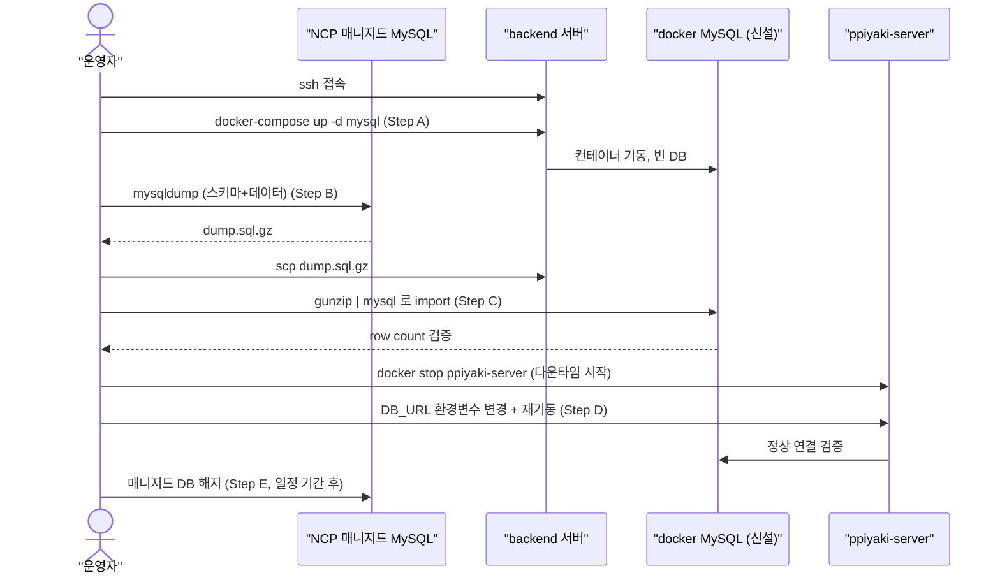

# DB 자체 호스팅 이전

## 1) 개요 (What / Why)
NCP 매니지드 MySQL을 해지하고, 동일한 backend 서버(211.188.48.217)의 docker MySQL로 운영 DB를 이전한다. **유일한 목적은 비용 절감**이다 — NCP 매니지드 MySQL 월 구독료를 제거하고 동일 서버의 잉여 자원에 DB를 띄운다.

대상: 시니어 사용자 수가 베타 규모(< 100명)인 현 시점에서 매니지드 백업·HA 기능을 사용할 만한 트래픽이 아니며, 비용 vs 안정성 트레이드오프에서 **비용을 택한 결정**.

## 2) 사용자 시나리오
- (운영자) 매니지드 DB 해지 후에도 시니어/보호자가 평소처럼 모든 기능을 사용 — 외부에서 보이는 동작 변화 없음.
- (운영자) 서버 장애 시 docker 볼륨의 데이터만으로 복구. **단일 서버 장애 시 데이터 손실 가능성을 수용한다.**

## 3) 요구사항
### 기능 요구사항
- [ ] backend 서버에 MySQL 8.4.6 컨테이너 신설 (NCP 매니지드와 동일 메이저 버전)
- [ ] `ppiyaki-monitoring` 도커 네트워크 안에서만 접근 (localhost-bind, 외부 포트 노출 금지)
- [ ] 영속 볼륨으로 `/var/lib/mysql` 데이터 보존 (서버 재부팅 후에도 유지)
- [ ] NCP 매니지드 DB 데이터를 mysqldump로 일괄 이전
- [ ] backend Spring Boot가 `DB_URL=jdbc:mysql://mysql:3306/ppiyaki`로 연결
- [ ] CD 배포가 정상 동작 (Github Secrets만 갱신)

### 비기능 요구사항
- **성능**: 단일 서버에서 backend + DB 공존 시 OOM 발생하지 않을 것 (서버 메모리 사용량 < 80%)
- **보안**: DB 외부 노출 금지 (3306 포트는 docker 내부 네트워크만)
- **백업**: 로컬 docker 볼륨 보존만 (사용자 결정, [§9](#9-결정-로그) 참조)
- **관측성**: prometheus mysqld_exporter 추가 (기존 monitoring stack에 결합)
- **자원**: MySQL 컨테이너에 메모리 제한 설정 (예: 1GB) — 서버 OOM 방지

## 4) 범위 / 비범위
### 포함
- backend 서버에 MySQL docker 컨테이너 신설
- 데이터 일괄 이전 (mysqldump → restore)
- backend-cd.yml의 DB 연결 정보 갱신
- monitoring stack에 mysqld_exporter 통합
- NCP 매니지드 DB 해지

### 제외 (Out of Scope)
- **외부(Object Storage 등) 백업**: 사용자가 명시적으로 로컬 볼륨만 선택 ([§9](#9-결정-로그))
- **자동 백업 cron**: 로컬 볼륨만 보관하므로 별도 cron 없음. 추후 별도 PR로 추가 가능
- **HA / replication**: 단일 인스턴스. master-slave 구성 없음
- **다운타임 최소화 (replication 기반 cutover)**: 사용자가 다운타임 무제한 허용 → mysqldump 기반 단순 마이그레이션
- **로컬 개발용 `docker-compose.yml`**: 이미 MySQL 컨테이너 정의되어 있음 — 변경 불필요
- **데이터 스키마 변경**: Flyway/migration 없이 raw dump → restore

## 5) 설계

### 5-1) 도메인 모델
DB 이전은 인프라 변경이며 도메인 엔티티/컨텍스트는 건드리지 않는다. `docs/ai-harness/06-domain-model.md` §5 엔티티 정의 그대로 유지.

### 5-2) API 엔드포인트
변경 없음 (인프라 변경).

### 5-3) 외부 연동
- **이전**: NCP 매니지드 MySQL (외부 endpoint)
- **이후**: 같은 서버의 docker MySQL (`ppiyaki-monitoring` 네트워크 내부 DNS `mysql:3306`)
- **NCP 매니지드 DB는 마이그레이션 검증 후 해지**

### 5-4) 데이터 흐름 / 마이그레이션 시퀀스

### 5-5) DB 마이그레이션
- 스키마 변경 없음. 기존 NCP DB의 스키마+데이터를 통째로 dump → restore
- AUTO_INCREMENT 값, FK, 인덱스 모두 dump에 포함되도록 `mysqldump --triggers --routines --events --single-transaction --quick`
- 마이그레이션 검증 쿼리: 주요 테이블의 row count, 최신 created_at 비교

## 6) 작업 분할 (예상 PR 리스트)

- [ ] **PR 1**: docker-compose에 prod MySQL 서비스 정의 (`infra/monitoring/docker-compose.yml`에 추가) + mysqld_exporter — 로컬에서 기동 검증
- [ ] **PR 2**: prod 마이그레이션 실행 — **사용자 위임 작업** (AI는 스크립트만 작성, 운영 명령은 사용자가 직접 실행). 다음 산출물:
  - `scripts/db-migration/dump-from-ncp.sh`
  - `scripts/db-migration/restore-to-docker.sh`
  - `scripts/db-migration/verify-counts.sh`
- [ ] **PR 3**: backend-cd.yml의 `DB_URL` 환경변수 주입 방식 검토 (값은 GitHub Secrets에서 변경, 코드 변경 불필요 가능)
- [ ] **PR 4**: NCP 매니지드 DB 해지 (운영자 콘솔 작업) + 도메인 문서 인프라 섹션 갱신

## 7) 테스트 전략
- **로컬 검증** (PR 1): `docker-compose up`으로 MySQL 기동 → backend 연결 → 기존 테스트 suite 통과
- **prod dump 검증**: mysqldump → import 후 row count, 최신 row, 핵심 FK 검증 (verify-counts.sh)
- **연결 검증**: backend 재기동 후 health check (`/actuator/health`) 200 확인
- **롤백 시나리오**: PR 3 적용 후 문제 발생 시 GitHub Secrets의 `DB_URL`을 NCP 매니지드로 되돌리고 backend 재기동 → 매니지드 DB가 살아있는 한 즉시 복구

## 8) 오픈 질문

| # | 질문 | 선택지 | 담당/기한 |
|---|---|---|---|
| Q1 | 서버 메모리 여유 확인 (MySQL + backend + monitoring stack 공존 가능?) | (a) ssh로 점검 (b) 메모리 부족하면 swap 추가 | @goohong / PR1 전 |
| Q2 | 데이터 사이즈 (dump 크기 예상) | (a) 작음(<100MB) → 즉시 (b) 큼 → 압축 전송 시간 산정 | @goohong / PR2 전 |
| Q3 | NCP 매니지드 DB 해지 시점 | (a) 마이그레이션 직후 (b) 1주일 후 (롤백 여지 확보) | @goohong / PR4 전 |
| Q4 | 로컬 볼륨 백업 안 함 — 서버 디스크 장애 시 데이터 손실 OK? | (a) OK (비용 우선) (b) 추후 cron + Object Storage 추가 | @goohong / 명시 결정 필요 |

## 9) 결정 로그
- **2026-05-20**: 초안 작성. 사용자 결정 반영:
  - 이전 위치 = backend 서버 docker (Option A, 비용 절감 최대화)
  - 다운타임 = 무제한 허용 (mysqldump 기반 단순 마이그레이션)
  - 백업 = 로컬 docker 볼륨만 (외부 백업 X) — **데이터 손실 위험은 비용 절감을 위해 수용**
- **2026-05-20**: 진행 방식 = Spec 먼저 합의 후 PR 분리하여 구현
- **2026-05-20**: 오픈 질문 해소
  - Q1 = 서버 메모리 2.5GB 가용 (총 3.8GB, 현 사용 1.1GB) → MySQL 1GB 할당 OK
  - Q2 = 데이터 사이즈 22.84MB (대부분은 `pill_identifications` 21.59MB/25,992rows 식약처 캐시). 마이그레이션 예상 시간 < 1분
  - Q3 = NCP 매니지드 DB 해지 시점 = 마이그레이션 직후 (롤백 여지 미확보 — 단순/빠른 정리 우선)
  - Q4 = 로컬 docker 볼륨 백업만 (디스크 장애 시 데이터 손실 수용)
- **2026-05-20**: status = draft → **ready** (Spec 합의 완료)
